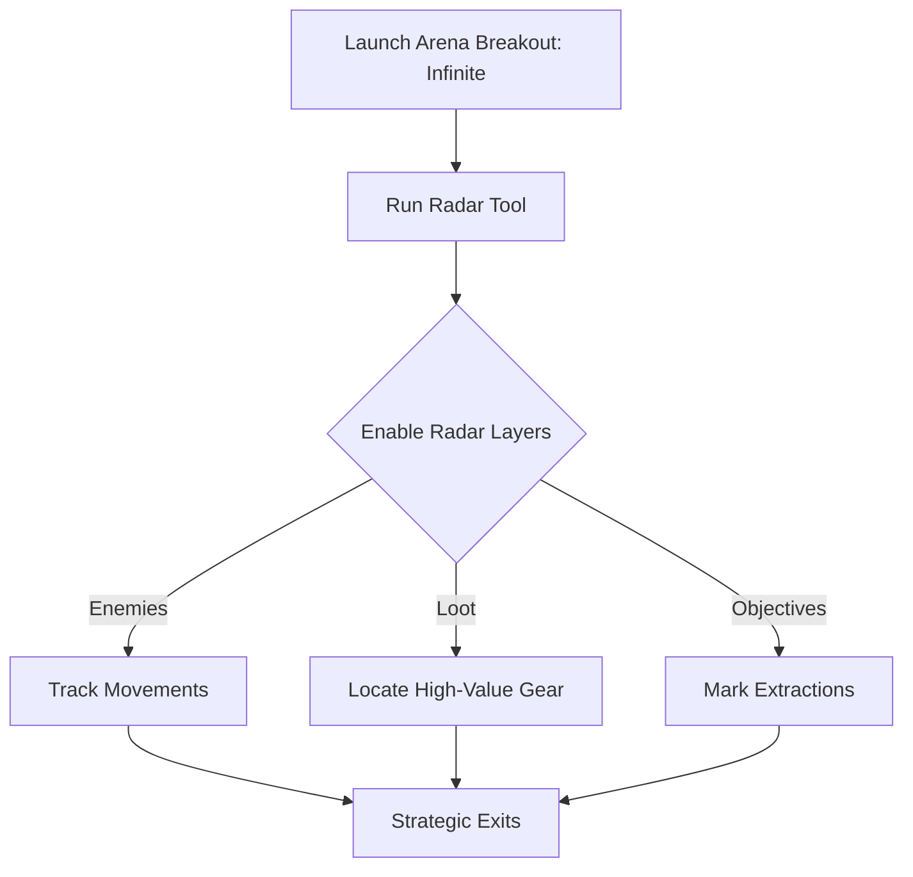

# Arena Breakout: Infinite Radar Vision 📡

The **Arena Breakout: Infinite Radar Vision Tool** is crafted for players who want unmatched battlefield awareness. By projecting a real-time radar overlay, it reveals the locations of enemies, loot containers, and objectives—removing guesswork and giving you a tactical edge in every raid.

Unlike full cheat suites, this tool focuses purely on **intelligence and positioning**, making it perfect for **training, sandbox practice, or custom runs**.

---

## 📖 Overview

Arena Breakout: Infinite thrives on tension—dark corners, sudden ambushes, and limited intel. But for players who want to refine strategy or experiment with raid routes, the Radar Vision Tool makes it possible to see **everything in motion**, from enemy squads to extraction points.

[!WARNING]
Use strictly for **offline/custom play**. Enabling radar in competitive servers risks bans.


---

## 🛠 Features

* **360° Radar Overlay** – Real-time detection of enemies and loot.
* **Enemy & Ally Tracking** – Different icons/colors for players and squads.
* **Loot Markers** 🎒 – Highlights ammo crates, medkits, and high-value gear.
* **Objective & Extraction Points** – Always know where to escape.
* **Range Indicators** – Displays exact distances to threats and resources.
* **Customizable Radar Display** – Adjust size, opacity, and position.
* **Toggle Hotkeys** – Turn radar on/off instantly with F1–F5 keys.

---

[](#)
[](#)
[](#)
[](#)


---

## 💻 Compatibility

| Platform       | Status         | Notes                          |
| -------------- | -------------- | ------------------------------ |
| Windows 10/11  | ✅ Full Support | Steam build tested             |
| Steam Deck     | ⚠️ Partial     | Requires Proton overlay tweaks |
| Linux (Proton) | ⚠️ Partial     | Radar works, visuals may vary  |
| Consoles       | ❌ Unsupported  | PC-only radar tool             |

[!NOTE]
Best used in **DirectX 12 mode** for maximum radar clarity.

---

## ⚡ Setup Guide

1. **Download & extract** the Radar Vision package.
2. Start *Arena Breakout: Infinite*.
3. Run `ABInfinite_Radar.exe` as Administrator.
4. Press `Insert` to open the radar settings overlay.
5. Customize radar scale and colors via `radar.ini`.

```ini
[RadarVision]
RadarSize=300
EnemyColor=255,0,0
LootColor=0,255,0
ObjectiveColor=0,0,255
MaxRange=5000
ToggleKey=F1
```

---

## 📊 Radar Vision Workflow



---

## ❓ FAQ

**Q: Does the radar show both NPCs and players?**
A: Yes, with separate colors/icons to distinguish them.

**Q: Can I resize the radar?**
A: Absolutely—adjustable via the config file.

**Q: Will it affect performance?**
A: Minimal FPS impact thanks to optimized rendering.

**Q: Is it updated with new patches?**
A: Yes, the radar tool is maintained alongside Arena Breakout: Infinite updates.

**Q: Can I use radar in online matches?**
A: Not recommended—safe for offline/custom use only.

---

## 🎯 Final Thoughts

The **Arena Breakout: Infinite Radar Vision Tool** is ideal for players who want to **train routes, plan raids, and boost situational awareness**. With clear overlays for enemies, loot, and objectives, it gives you the tactical clarity to dominate every encounter.

[](#)
[](#)
[](#)

---
